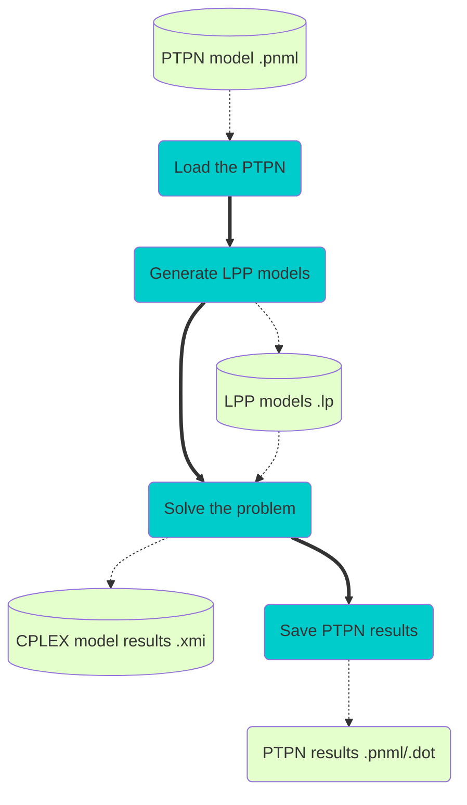

# Solver modules and CLI

Modules are organized in two main packages:
1. ```net``` including the classes responsible of importing/exporting/printing the PTPN models
2. ```solver``` including the classes responsible of extracting the relevant information from the
net, generating the LPPs for the bound computation, solving the LPPs and mapping the results
to the PTPN model andupdating the PTPN models with the results.

The modules rely on the following Python external packages:

- ```cplex```: LPP model generation and its solution
- ```scipy```: Use of sparse matrices (dok arrays)
- ```graphviz```: Generation of ```dot``` graphical PTPN models

Beside, ```ptpnbound.py``` is the CLI script and relies on the ```click``` package.

Also, the following Python (internal) packages are used:

- ```xml.dom```: XML parsing of ```pnml``` PTPN models (```minidom``)
- ```math```: use of exponential function
- ```string```: generation of random IDs
- ```os```: operating system functionalities


## Dataflow/workflow overview 


## Architecture
==WIP==

