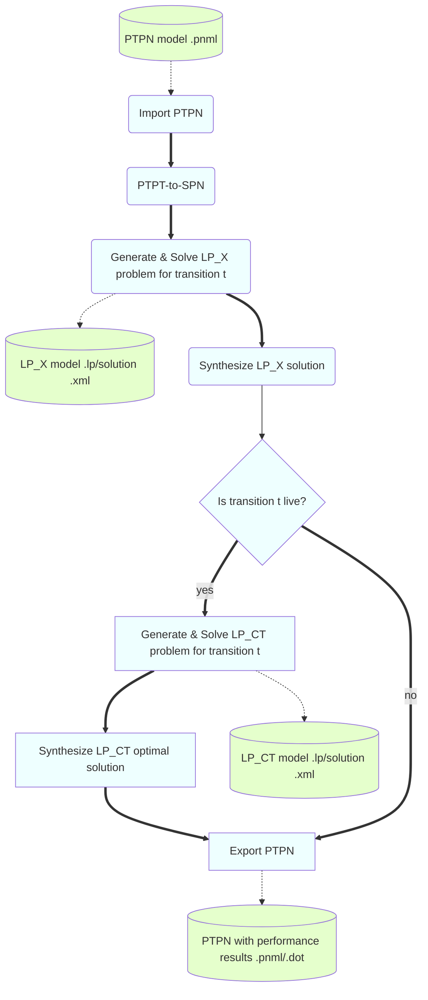
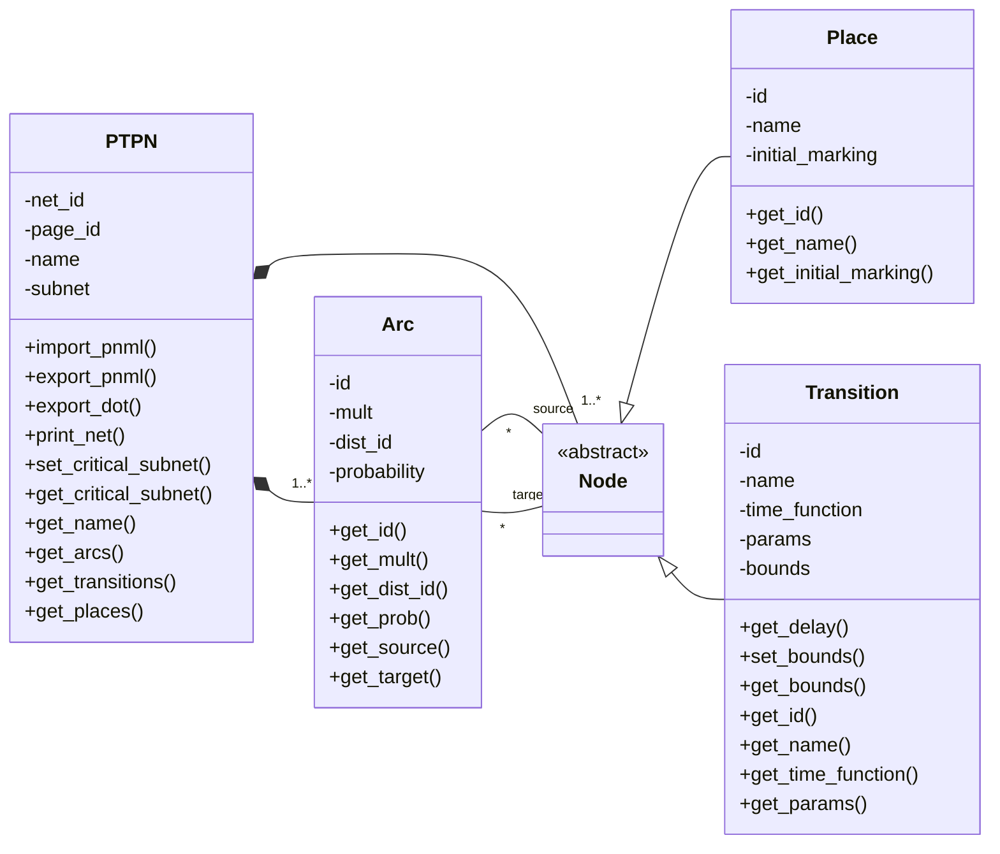
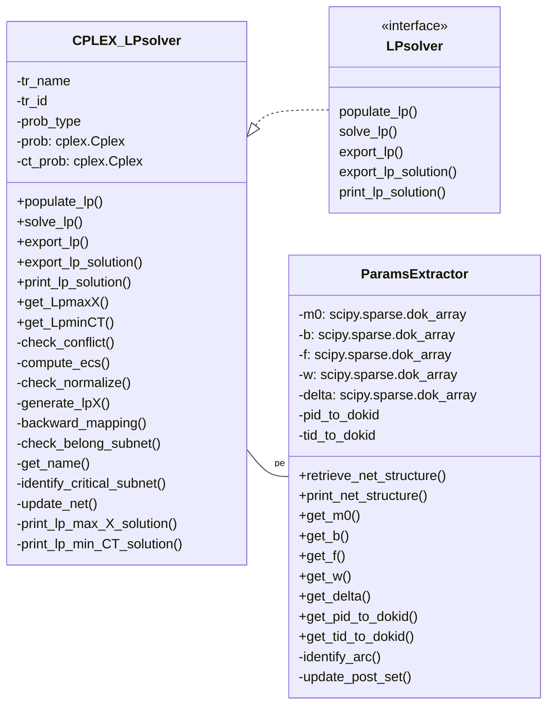

# Solver modules and CLI

Modules are organized in two main packages:
1. ```net``` including the classes responsible of importing/exporting/printing the PTPN models
2. ```solver``` including the classes responsible of extracting the relevant information from the
net, generating the LPPs for the bound computation, solving the LPPs and mapping the results
to the PTPN model andupdating the PTPN models with the results.

The modules rely on the following Python external packages:

- ```cplex```: LPP model generation and its solution
- ```scipy```: Use of sparse matrices (dok arrays)
- ```graphviz```: Generation of ```dot``` graphical PTPN models

Beside, ```ptpnbound.py``` is the CLI script and relies on the ```click``` package.

Also, the following Python (internal) packages are used:

- ```xml.dom```: XML parsing of ```pnml``` PTPN models (```minidom``)
- ```math```: use of exponential function
- ```string```: generation of random IDs
- ```os```: operating system functionalities


## Dataflow/workflow overview 
The main workflow and the data loaded/stored are shown in the following


## Architecture
The ```net``` package includes the following clases:

The ```solver``` package includes the following clases:


## Import/Output PTPN ```pnml``` format
The tool implements the import/export functionalities through XML deserialization/serialization.
An XML schema is defined for PTPN that is compliant with the standard PNML for Place-Transition nets.
Figure, reported below, shows the PTPN interchange format meta-model, where 
white classes are from the PNML meta-model and the colored classes represent the tool-specific
extensions. 
The yellow ones are core concepts of the PTPN formalism, i.e., discrete probability distributions over output places of a transition and continuous probability distributions associated to transition delays.
The blue classes are concepts related to the results obtained from the performance 
bound solver, i.e., the performance bounds and the slowest subnet.


